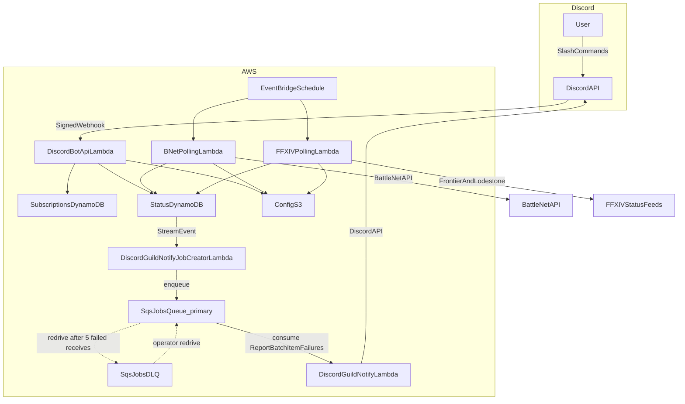

# ServersUp Backend

A modern, highly-available backend suite for game server status polling and Discord-based notification management. Built with **Go** and designed for **AWS Serverless** infrastructure.

## Project Summary

ServersUp Backend provides a robust infrastructure for monitoring game server availability (World of Warcraft via Battle.net, Final Fantasy XIV via Lodestone/frontier status) and allowing users to subscribe to real-time status alerts via Discord. The system is designed for multi-region high availability and uses a dynamic CI/CD pipeline for seamless deployments.

## Architecture



### How it works

ServersUp has two main paths: **commands** (Discord → bot) and **notifications** (status change → Discord channels).

**Commands**  
Users run slash commands in Discord. Discord calls the bot API (Lambda behind a function URL). The bot reads and writes **subscriptions** and **current status** in DynamoDB, using a shared **server catalog** in S3 so friendly names line up with the same server IDs the pollers use.

**Status polling**  
On a schedule (EventBridge), one or more **poller** Lambdas check whether game servers are up or down. Each poller is built for a particular way of getting status—REST API, JSON feed, HTML scrape, or similar—without tying the overall design to one game or vendor. Today that includes Battle.net realm polling (separate regional Lambdas) and FFXIV world polling (frontier JSON with a Lodestone HTML fallback when the feed is unavailable). Results are stored in a shared **status** table in DynamoDB. Only rows that actually change are interesting downstream; unchanged polls do not spam the notification path.

**Notifications**  
When a status row changes, **DynamoDB Streams** emits an event. A **job-creator** Lambda handles that stream: for each Discord subscription on that server, it enqueues a small job on **SQS**. **Notifier** Lambdas consume those jobs in batches and post to the right channel (and optional role mention).

The queue is there because load is **not evenly spread across servers**—popular regions concentrate many subscribers on the same status flip. The stream burst is turned into many queue messages; SQS drives **multiple notifier Lambdas in parallel** and smooths work through batching, instead of one hot server update fanning out in a single invocation.

**If a notification cannot be sent**  
Some failures are treated as permanent (bad job data, or Discord will not allow the post). Those are removed from the main queue so they do not retry for days.

Others look temporary (rate limits, Discord or network trouble). Those stay on the main queue and are retried. After several failed attempts, the job moves to a **dead-letter queue** so you can inspect it, fix the cause, and optionally redrive back to the main queue in AWS.

**Configuration (change behavior without redeploying logic)**  
- **Shared catalog** (`server-mapping.json` in S3): which games and servers exist, how they appear in Discord, and how names map to status IDs. Used by the bot and notifiers.  
- **Per-poller config** (separate JSON in S3, e.g. Battle.net realm lists per region, FFXIV world catalog): what that poller should check. Add servers or regions by editing JSON, not Go.  
- **Secrets** (SSM Parameter Store): API keys and tokens. Lambdas load these at runtime.

**Caching**  
Hot paths avoid hammering S3, SSM, or DynamoDB on every request: server-mapping and secrets are cached with a TTL; the bot caches guild channel names and `/status` results briefly; pollers reuse credentials across invocations on a warm instance. The Battle.net client reuses HTTP connections to each regional API host during a poll (keep-alive, tuned idle pool for concurrent realm fetches).

**Logging and metrics**  
All Lambdas emit **structured JSON logs** (`slog`) to CloudWatch; verbosity is controlled with `LOG_LEVEL`. Selected failures and counts are published as **CloudWatch metrics** (EMF in log lines, namespace `ServersUp`)—poll errors, BNet poll latency (`PollDurationMs`, `PollBnetApiAvgMs`, `PollBnetApiMaxMs`), and failed Discord sends—so you can alarm and trend without parsing every log line. BNet pollers also log a **`Poll timing`** summary per invocation (same numbers as the latency metrics).

## Technology Stack

*   **Language**: Go 1.25+
*   **Cloud Infrastructure**: AWS Lambda (Function URL & Event-driven)
*   **Storage**: DynamoDB (Status & Subscription storage), S3 (Dynamic configuration)
*   **Security**: AWS OIDC (Deployment), AWS SSM Parameter Store (Secrets), Ed25519 (Discord signature verification with timestamp replay protection)
*   **CI/CD**: GitHub Actions (Dynamic Matrix Deployment)

## Design choices (cost and efficiency)

### Why Go

- **Low operational overhead**: fast cold starts and low memory footprint are a strong fit for Lambda workloads.
- **Concurrency**: polling many servers benefits from cheap parallelism; Go’s goroutines make it straightforward to keep total wall-clock time low without a complex runtime.
- **Simple deployment**: static binaries (`bootstrap` for `provided.al2023`) reduce dependency and packaging complexity.

### Why serverless

- **Sporadic / bursty workloads**: polling and notifications happen on a schedule or in reaction to status changes; Lambda scales with demand and stays idle when nothing happens.
- **Cost**: paying per-invocation fits the project’s usage pattern better than always-on services.

### Why SQS between “job creator” and “notifier”

Player populations cluster on certain regions and realms, so one status change can mean a large burst of notify jobs. The stream → **job creator** → **SQS** → **notifier** path helps:

- **Spread hot servers**: decouple the DynamoDB stream spike from notifier concurrency.
- **Fan out Lambdas**: SQS triggers many notifier invocations and batches work across them.
- **Dead-letter queue**: jobs that still fail after repeated tries are set aside for review instead of retrying forever.

## Directory Structure

```text
├── cmd/
│   ├── bnet-polling-function/              # Lambda: polls Blizzard API (US/EU/KR/TW); logic in internal/bnetpoller; CI deploys one build to four function names
│   ├── ffxiv-polling-function/             # Lambda: polls FFXIV world status; logic in internal/ffxivpoller
│   ├── discord-bot-api/                    # Lambda entrypoint for Discord interactions
│   ├── discord-guild-notify-job-creator/   # Lambda: DDB stream → SQS notify jobs
│   ├── discord-guild-notify-lambda/        # Lambda: SQS → Discord channel messages
│   └── config-reader/                      # CI utility: deployment matrices from YAML
├── internal/
│   ├── bnet/                    # Battle.net API client and models
│   ├── ffxivlodestone/          # FFXIV Lodestone HTML + frontier JSON parsing
│   ├── ffxivpoller/             # FFXIV polling Lambda handler
│   ├── config/                  # AWS config provider (S3/SSM)
│   ├── db/                      # DynamoDB access (status + subscriptions)
│   ├── discord/                 # Interaction types and signature verification
│   ├── discordbot/              # Slash command handlers (subscribe, status, etc.)
│   ├── servermap/               # server-mapping.json loader and lookup
│   └── models/                  # Shared data models
└── .github/workflows/           # Unified dynamic deployment pipeline
```

## Core Services

### 1. Game status pollers

**Battle.net (WoW)** — [`bnet-polling-function`](cmd/bnet-polling-function/) / [`internal/bnetpoller`](internal/bnetpoller/): scheduled Lambdas per region (US/EU/KR/TW) call the Blizzard API for configured connected realms (bounded concurrency, HTTP keep-alive in [`internal/bnet`](../internal/bnet)), and write UP/DOWN to the shared status table.

**FFXIV** — [`ffxiv-polling-function`](cmd/ffxiv-polling-function/) / [`internal/ffxivpoller`](internal/ffxivpoller/): a scheduled Lambda loads the world catalog from S3, reads live status from the frontier JSON feed, and falls back to the Lodestone HTML page only if that feed cannot be fetched or parsed. Worlds are stored under game `ffxiv` with provider `lodestone`.

Both pollers use structured logging (`slog`) and CloudWatch metrics for poll success and errors. See [`docs/config.md`](docs/config.md) for JSON shapes and maintainer generation workflows.

### 2. Discord Bot API
A Lambda Function URL-backed API that processes Discord interactions. Command logic lives in **`internal/discordbot`**; [`cmd/discord-bot-api`](cmd/discord-bot-api/) is a thin entrypoint.

*   **Slash commands**: `/subscribe`, `/unsubscribe`, `/subscriptions`, `/games`, `/regions`, `/servers`, `/status`, `/help`.
*   **Discovery & lookup**: `/games`, `/regions`, and `/servers` list configured games, regions, and servers from S3 `server-mapping.json` (with autocomplete; regions depend on the selected game). `/status` reads the current **UP/DOWN** value from the status DynamoDB table.
*   **Rate limiting**: `/status` is capped per user and per guild in-process (warm Lambda instances) to limit DynamoDB reads; over-limit replies are ephemeral.
*   **Dynamic mapping**: Human names (e.g. `illidan`) map to provider/region/identifier via `server-mapping.json`.
*   **Security**: Mandatory Ed25519 signature verification plus a maximum age on `X-Signature-Timestamp` to reject replayed requests.

### 3. Discord guild notify pipeline
When status changes in DynamoDB, a stream-triggered job creator enqueues per-subscription work to SQS; a notifier Lambda posts to subscribed Discord channels (optional role mention). See **How it works** above for the end-to-end story and how the main queue and dead-letter queue behave.

- **Queues**: primary `discord-guild-notify-jobs`; dead-letter `discord-guild-notify-jobs-dlq`.
- **Reliability**: transient send failures retry on the primary queue; clearly permanent failures are dropped; repeatedly failing jobs land in the dead-letter queue for operator review and redrive.
- **Metrics**: `NotifySendError` in CloudWatch when Discord rejects a channel post.

## ⚙️ CI/CD Pipeline

The project features a **Fully Dynamic Deployment Matrix**.
*   **Auto-Discovery**: The workflow automatically detects any directory in `cmd/` containing a `deployment-config.yaml` with `type: lambda`.
*   **Zero-Touch Scaling**: New services are automatically built and deployed to their specified regions without manual workflow edits.
*   **Security**: Uses GitHub OIDC to assume AWS roles, eliminating the need for long-lived credentials.

## ⚙️ Configuration & Extensibility

The project utilizes a multi-layered configuration system designed for maximum flexibility and runtime extensibility without requiring code changes or redeployments.

### 📦 S3-Based Dynamic Config
Core business logic, such as server-to-provider mappings and polling targets, is stored as JSON objects in Amazon S3.
*   **Decoupled Logic**: Add new games, regions, or servers by simply updating a JSON file.
*   **Runtime Updates**: Services pull the latest configuration at execution time, allowing for instant system-wide changes.

### 🔐 SSM & Environment Secrets
Sensitive data and environment-specific toggles are managed through AWS SSM Parameter Store and standard Environment Variables.
*   **Secure Secrets**: API keys and client secrets are stored encrypted in SSM.
*   **Infrastructure Agnostic**: The `internal/config` provider abstracts the retrieval logic, making it easy to swap configuration sources if needed.

---
*Created and maintained by the ServersUp Team.*
