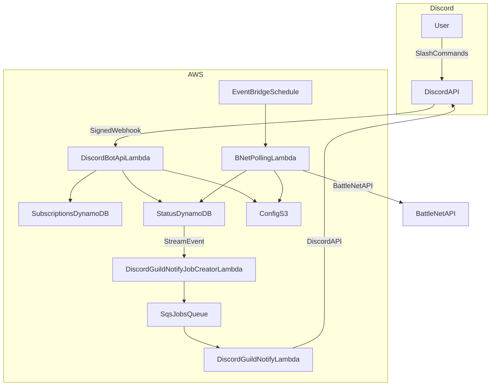

# ServersUp Backend

A modern, highly-available backend suite for game server status polling and Discord-based notification management. Built with **Go** and designed for **AWS Serverless** infrastructure.

## Project Summary

ServersUp Backend provides a robust infrastructure for monitoring game server availability (starting with Battle.net/World of Warcraft) and allowing users to subscribe to real-time status alerts via Discord. The system is designed for multi-region high availability and uses a dynamic CI/CD pipeline for seamless deployments.

## Architecture



## Technology Stack

*   **Language**: Go 1.25+
*   **Cloud Infrastructure**: AWS Lambda (Function URL & Event-driven)
*   **Storage**: DynamoDB (Status & Subscription storage), S3 (Dynamic configuration)
*   **Security**: AWS OIDC (Deployment), AWS SSM Parameter Store (Secrets), Ed25519 (Discord signature verification with timestamp replay protection)
*   **CI/CD**: GitHub Actions (Dynamic Matrix Deployment)

## Design choices (cost and efficiency)

### Why Go

- **Low operational overhead**: fast cold starts and low memory footprint are a strong fit for Lambda workloads.
- **Concurrency**: polling many servers benefits from cheap parallelism; Go’s goroutines make it straightforward to keep total wall-clock time low without a complex runtime.
- **Simple deployment**: static binaries (`bootstrap` for `provided.al2023`) reduce dependency and packaging complexity.

### Why serverless

- **Sporadic / bursty workloads**: polling and notifications happen on a schedule or in reaction to status changes; Lambda scales with demand and stays idle when nothing happens.
- **Cost**: paying per-invocation fits the project’s usage pattern better than always-on services.

### Why SQS between “job creator” and “notifier”

Guild notifications can concentrate heavily on a small number of popular servers. The DynamoDB stream → **job creator** → **SQS** → **notifier** design helps:

- **Avoid hot-spotting**: decouples bursty stream events from Discord outbound sends.
- **Smooth spikes**: the queue buffers surges so the notifier can process at a steady rate.
- **Scale out safely**: SQS-triggered concurrency lets the notifier fan out work without a single server update causing a huge synchronous blast.

## Directory Structure

```text
├── cmd/
│   ├── bnet-polling-function/              # Lambda: polls Blizzard API for realm status
│   ├── discord-bot-api/                    # Lambda entrypoint for Discord interactions
│   ├── discord-guild-notify-job-creator/   # Lambda: DDB stream → SQS notify jobs
│   ├── discord-guild-notify-lambda/        # Lambda: SQS → Discord channel messages
│   └── config-reader/                      # CI utility: deployment matrices from YAML
├── internal/
│   ├── bnet/                    # Battle.net API client and models
│   ├── config/                  # AWS config provider (S3/SSM)
│   ├── db/                      # DynamoDB access (status + subscriptions)
│   ├── discord/                 # Interaction types and signature verification
│   ├── discordbot/              # Slash command handlers (subscribe, status, etc.)
│   ├── servermap/               # server-mapping.json loader and lookup
│   └── models/                  # Shared data models
└── .github/workflows/           # Unified dynamic deployment pipeline
```

## Core Services

### 1. BNet Polling Function
An event-driven Lambda that periodically fetches the status of configured WoW realms.
*   Uses a configurable semaphore to limit concurrent connections to Blizzard.
*   Stores results in a provider-agnostic format in DynamoDB.
*   Structured logging via `slog` for CloudWatch analysis.

### 2. Discord Bot API
A Lambda Function URL-backed API that processes Discord interactions. Command logic lives in **`internal/discordbot`**; [`cmd/discord-bot-api`](cmd/discord-bot-api/) is a thin entrypoint.

*   **Slash commands**: `/subscribe`, `/unsubscribe`, `/subscriptions`, `/games`, `/servers`, `/status`, `/help`.
*   **Discovery & lookup**: `/games` and `/servers` list configured games and servers from S3 `server-mapping.json` (with autocomplete). `/status` reads the current **UP/DOWN** value from the status DynamoDB table (`DDB_TABLE_NAME`).
*   **Rate limiting**: `/status` is capped per user and per guild in-process (warm Lambda instances) to limit DynamoDB reads; over-limit replies are ephemeral.
*   **Dynamic mapping**: Human names (e.g. `illidan`) map to provider/region/identifier via `server-mapping.json`.
*   **Security**: Mandatory Ed25519 signature verification plus a maximum age on `X-Signature-Timestamp` to reject replayed requests.

### 3. Discord guild notify pipeline
When status changes in DynamoDB, a stream-triggered job creator enqueues per-subscription work to SQS; a notifier Lambda posts to subscribed Discord channels (optional role mention).

## ⚙️ CI/CD Pipeline

The project features a **Fully Dynamic Deployment Matrix**.
*   **Auto-Discovery**: The workflow automatically detects any directory in `cmd/` containing a `deployment-config.yaml` with `type: lambda`.
*   **Zero-Touch Scaling**: New services are automatically built and deployed to their specified regions without manual workflow edits.
*   **Security**: Uses GitHub OIDC to assume AWS roles, eliminating the need for long-lived credentials.

## ⚙️ Configuration & Extensibility

The project utilizes a multi-layered configuration system designed for maximum flexibility and runtime extensibility without requiring code changes or redeployments.

### 📦 S3-Based Dynamic Config
Core business logic, such as server-to-provider mappings and polling targets, is stored as JSON objects in Amazon S3.
*   **Decoupled Logic**: Add new games, regions, or servers by simply updating a JSON file.
*   **Runtime Updates**: Services pull the latest configuration at execution time, allowing for instant system-wide changes.

### 🔐 SSM & Environment Secrets
Sensitive data and environment-specific toggles are managed through AWS SSM Parameter Store and standard Environment Variables.
*   **Secure Secrets**: API keys and client secrets are stored encrypted in SSM.
*   **Infrastructure Agnostic**: The `internal/config` provider abstracts the retrieval logic, making it easy to swap configuration sources if needed.

---
*Created and maintained by the ServersUp Team.*
