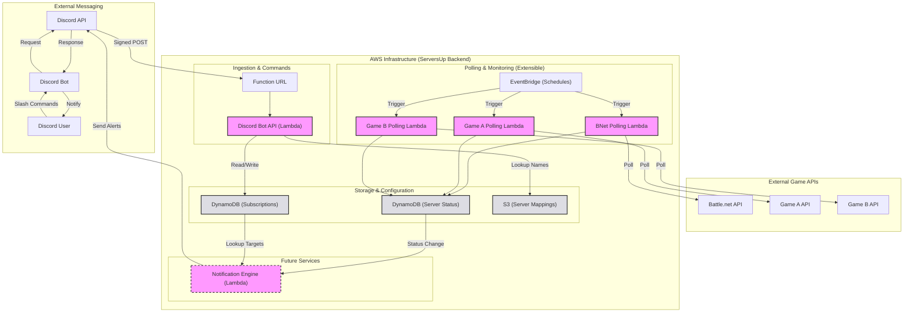

# ServersUp Backend

A modern, highly-available backend suite for game server status polling and Discord-based notification management. Built with **Go** and designed for **AWS Serverless** infrastructure.

## 🚀 Project Summary

ServersUp Backend provides a robust infrastructure for monitoring game server availability (starting with Battle.net/World of Warcraft) and allowing users to subscribe to real-time status alerts via Discord. The system is designed for multi-region high availability and uses a dynamic CI/CD pipeline for seamless deployments.

## 🏗 Architecture



## 🛠 Technology Stack

*   **Language**: Go 1.25+
*   **Cloud Infrastructure**: AWS Lambda (Function URL & Event-driven)
*   **Storage**: DynamoDB (Status & Subscription storage), S3 (Dynamic configuration)
*   **Security**: AWS OIDC (Deployment), AWS SSM Parameter Store (Secrets), Ed25519 (Discord Signature Verification)
*   **CI/CD**: GitHub Actions (Dynamic Matrix Deployment)

## 📂 Directory Structure

```text
├── cmd/
│   ├── bnet-polling-function/   # Lambda: Periodically polls Blizzard API for realm status
│   ├── discord-bot-api/         # Lambda: Handles Discord Slash Commands (subscribe/unsubscribe)
│   └── config-reader/           # Utility: Generates deployment matrices from YAML configs
├── internal/
│   ├── bnet/                    # Battle.net API client and models
│   ├── config/                  # AWS Config Provider (S3/SSM)
│   ├── db/                      # Generic DynamoDB access layer
│   ├── discord/                 # Discord interaction models and security logic
│   └── models/                  # Shared universal data models
└── .github/workflows/           # Unified dynamic deployment pipeline
```

## 📡 Core Services

### 1. BNet Polling Function
An event-driven Lambda that periodically fetches the status of configured WoW realms.
*   Uses a configurable semaphore to limit concurrent connections to Blizzard.
*   Stores results in a provider-agnostic format in DynamoDB.
*   Structured logging via `slog` for CloudWatch analysis.

### 2. Discord Bot API
A Lambda Function URL-backed API that processes Discord Interactions.
*   **Slash Commands**: Supports `/subscribe` and `/unsubscribe` with friendly name mapping.
*   **Dynamic Mapping**: Uses an S3-stored JSON file to translate human names (e.g., "Illidan") to technical IDs.
*   **Security**: Implements mandatory Ed25519 signature verification to ensure requests originate from Discord.

## ⚙️ CI/CD Pipeline

The project features a **Fully Dynamic Deployment Matrix**.
*   **Auto-Discovery**: The workflow automatically detects any directory in `cmd/` containing a `deployment-config.yaml` with `type: lambda`.
*   **Zero-Touch Scaling**: New services are automatically built and deployed to their specified regions without manual workflow edits.
*   **Security**: Uses GitHub OIDC to assume AWS roles, eliminating the need for long-lived credentials.

## ⚙️ Configuration & Extensibility

The project utilizes a multi-layered configuration system designed for maximum flexibility and runtime extensibility without requiring code changes or redeployments.

### 📦 S3-Based Dynamic Config
Core business logic, such as server-to-provider mappings and polling targets, is stored as JSON objects in Amazon S3.
*   **Decoupled Logic**: Add new games, regions, or servers by simply updating a JSON file.
*   **Runtime Updates**: Services pull the latest configuration at execution time, allowing for instant system-wide changes.

### 🔐 SSM & Environment Secrets
Sensitive data and environment-specific toggles are managed through AWS SSM Parameter Store and standard Environment Variables.
*   **Secure Secrets**: API keys and client secrets are stored encrypted in SSM.
*   **Infrastructure Agnostic**: The `internal/config` provider abstracts the retrieval logic, making it easy to swap configuration sources if needed.

---
*Created and maintained by the ServersUp Team.*
